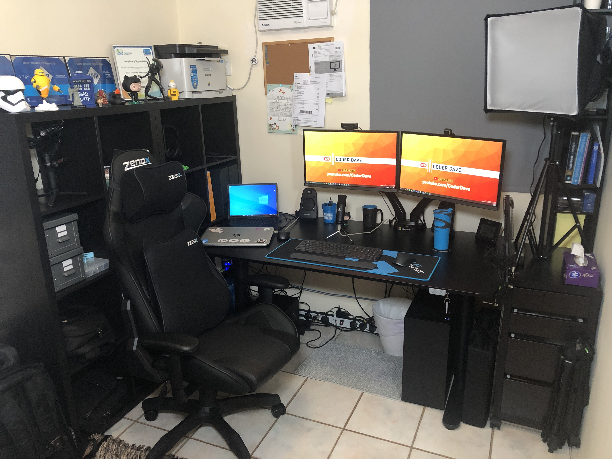
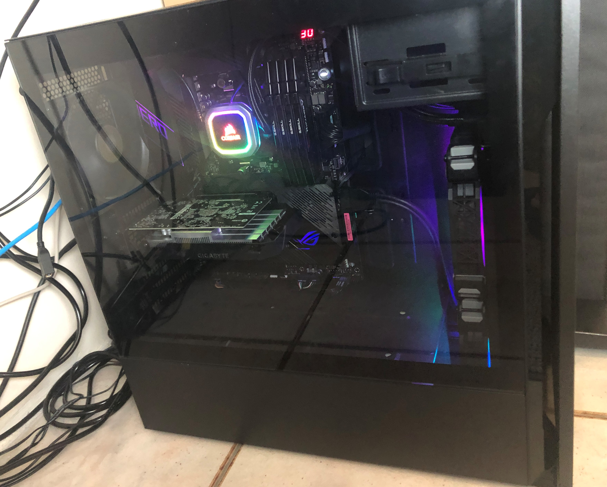
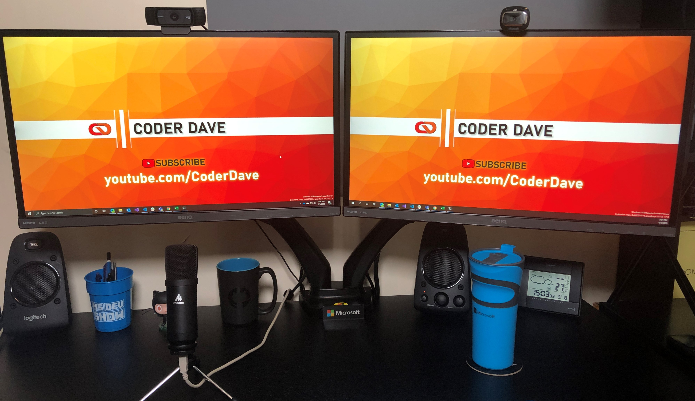
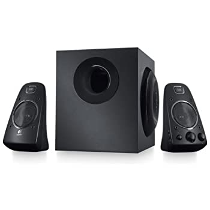
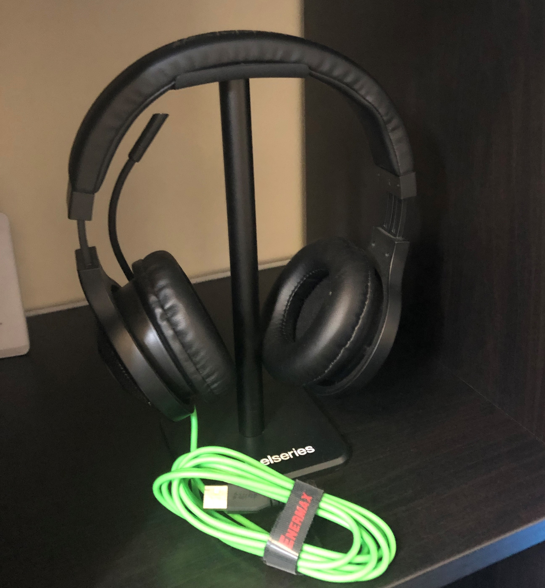
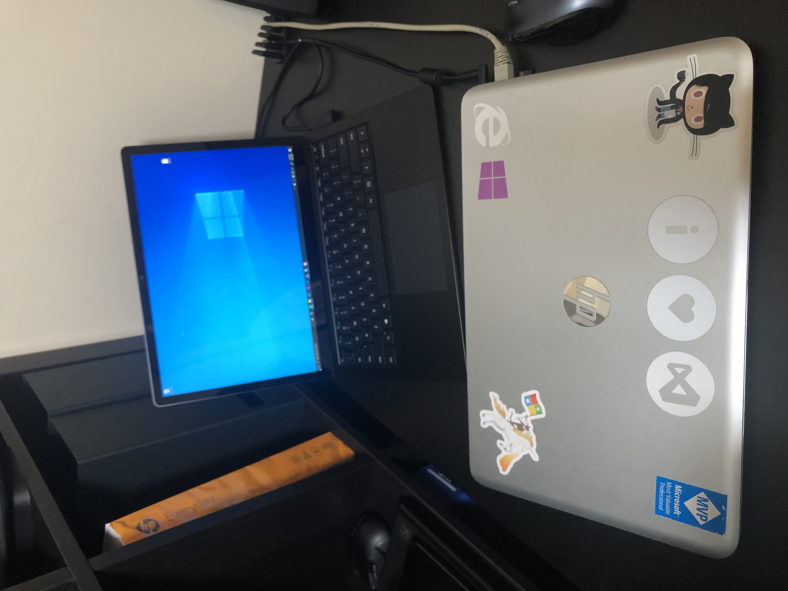
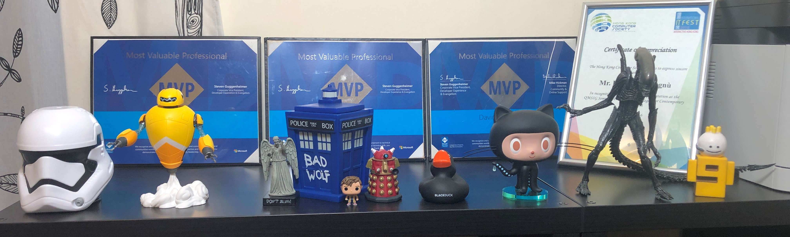

# My _Work from Home_ Setup

> UPDATED: 11 November 2020
  
> NOTE: if you want to see my full __YouTube Studio__ setup, then check the [YouTube Setup description](YouTube%20Setup.md).

Originally this was [a post on my Blog](https://dev.to/n3wt0n/my-home-office-revealed-1l42) after a few people on Twitter asked about my setup. But since things keeps evolving, I decided to host htis here so it will always be up to date.

This post will break down what I'm currently using in my home office, where I do all my work when not on an airplane.

## Table and Chair

Let's start with the basics, I have an Ikea Bekant standing table, 160x80cm. Standing tables are life hehe.

And my chair is a Zenox Saturn Racing Black, with the addition of the memory foam Pillows (a must have for long hours at the computer)

## Main Computer

After years of going only with Laptops (see the _Laptops_ section below), I've recently decided to switch back to desktop PC. And so I did build my __own workstation__.

And wow it is fast!

These are the specs:

- CPU: AMD Ryzen 9 3950X, 16 cores @ 3.5 Ghz - https://geni.us/kHkH
- RAM: G.Skill Ripjaws V, 64 Gb DDR4-3200, 16 x 4 Gb - https://geni.us/bwpL
- SSD: Corsair MP600, M.2, NVMe, 1 Tb, PCI-Express Gen.4 - https://geni.us/iToct5
- GPU: Gigabyte NVIDIA GeForce GTX 1650 OC, 4 Gb GDDR5 - https://geni.us/fXSV5t
- MOBO: ASUS ROG Crosshair VIII Hero, X570 - https://geni.us/wg8G
- PSU: EVGA SuperNOVA 750 G+, 80 Plus Gold 750W, Fully Modular - https://geni.us/BKQ7
- COOLING: Corsair Hydro Series, H115i RGB PLATINUM, 280mm - https://geni.us/BKwADrJ
- CASE: Cooler Master Silencio S600, Midi Tower - https://geni.us/A76DSyP

I published 2 videos on my [YouTube channel](https://www.youtube.com/CoderDave) when building it.

You can take a look at them here:

1. Assembling everything: https://youtu.be/tG0O8vsO1LE
2. Case and finalizing: https://youtu.be/K2VaRoK7Zjw

## Monitors

As you can see, I'm using a dual-monitor setup.

My monitors of choice are __Benq VZ2350__ 23.5''.

I think they are fantastic monitors at their price range. Not sure I would use it for gaming, but for office-work, coding and video editing they are great.

Unfortunately it seems like they are not avalable anymore anywhere, but those GW2480 should be pretty close: https://geni.us/snuBEt0

## Keyboard and Mouse

After using the _Microsoft Skulpt Ergonomic_ kit for more than a year now, with great success, now I've switched back to Logitech.

I now use  the __Logitech MX Keys Advanced Wireless Illuminated Keyboard (Graphite)__, which is a very good keyboard even tho it is maybe a tiny bit too small.
And I paired it with its palm rest, for max confort.

For the mouse, I went with the __Logitech MX Master 3__, which is fantastic!

And below everything, I have a Logitech large cloth mouse mat.

You can find the keyboard here: https://geni.us/RMXB7  
The palm rest here: https://geni.us/EmTCKRD  
And the mouse here: https://geni.us/GwwON

## Webcams

As you can see in the previous image, I have a multi-webcam setup.

My main webcam, which I use for most of my conf-calls and for some _quick'n'dirty_ video recording, is the __Logitech C920__, which is a 1080p cam.

It is a quite good webcam (you can find many reviews online) but unfortunately it has some autofocus problems in some conditions (again, a lot of reviews about this as well).

On my right monitor, I have a second webcam for some more side views. It is a __Microsoft LifeCam HD 3000__, and even tho its resolution is only 720p I have to say that the image quality is pretty nice.

Here are the links to those webcams:  
Logitech C920 Pro: https://geni.us/QDma5Wf  
Microsoft LifeCam HD 3000: https://geni.us/CYgKLlt

## Microphone

Nothing too _pro_ here, I have a __Maono A425 Plus__. It is a decent Cardioid Condenser USB Microphone.

The nice thing is that it has all you need in the box: the desk stand with the table clamp, a portable stand, the shock mount, the pop filter and even a windscreen cap.

Highly recommended, if you don't need a studio quality mic.

You can find this microphone here: https://geni.us/4c0Lon

## Speaker

I've recently upgraded my old _Trust_ system to a new, more powerful one.

I now have a __Logitech Z623__. This thing is a beast.

It's a 200W RMS 2.1 system, THX certified... It's heavy and bulky, but boy it sounds good :)

You can find it here: https://geni.us/AI7S

## Headphones

I use 2 headphones, the Microsoft Sirface Headphones and a pair of Razer ones.

The __Microsoft Surface Headphones__ are my main ones when listening to music or for calls when I'm travelling.

The __Razer Kraken USB__ instead is my go-to pair of headphones for whenever I cannot (or don't want to) use the external speakers for calls, videos, etc.

You can find these headphones here:  
Surface Headphones: https://geni.us/PBoyefE  
Razer Kraken: https://geni.us/vRxoV  

## Network: NAS, Switch, Wifi and Router

I have a __QNAP TS-228A__ NAS where I save all my videos (Raw and finished) together will all my backups (of course I also use ___OneDrive___ for files and others, but videos and backupsets are just too big).
It has 2 x 3TB disks in Raid-1.

On the Networking side, I have a __Linksys LGS108__ gigabit switch, with 8 x 1Gb ports.

My router is a __Nighthawk R8000P__, which is awesome and has also super fast WiFi.

You can find those devices here:  
Nas - QNAP TS-228A: https://geni.us/MEiia  
Switch - Linksys LGS108: https://geni.us/wBAYRA  
Router - Nighthawk R8000P: https://geni.us/7os5Ca   

## Laptops

I also use laptops to complement my main desktop workstation.

My main laptop is a __Microsoft Surface Laptop 3__, with an Intel i7-1065G7 CPU, 16GB of RAM and 512 GB SSD.

I use this when I travel and deliver the engagement at client sites.

I keep all the relevant documents and files on _OneDrive_ so they are automatically shared across al my PCs, and I developed some scripts to synchronize other files and settings. Pretty sweet.

You can buy the Surface Laptop 3 here (with the same config as mine): https://geni.us/TnzJqd

My secondary laptop is a HP Envy 15, with an Intel i7-4700MQ, 16GB of RAM and 512 GB SSD. Even though this machine is way older than my Surface, its CPU is so powerful that it outperforms the Surface Laptop 3 in some CPU-intensive tasks!

I use this laptop to do maintenance on some old projects that require a ton of legacy dependencies that I don't want to install on my more recent machines.

## Miscellaneous

I am a big fan of Doctor Who and Alien... so I simply had to have some props :)

I've tried to collect some links for you:

Doctor Who - Bad Wolf Tardis: https://geni.us/wsd2C31  
Doctor Who - Weeping Angel: https://geni.us/UwnrdR  
Alien - 7'' figurine: https://geni.us/ceT4  

Have I missed something?

Anything else you wanna know? Let me know in the comments :)

Happy WFH everyone.
