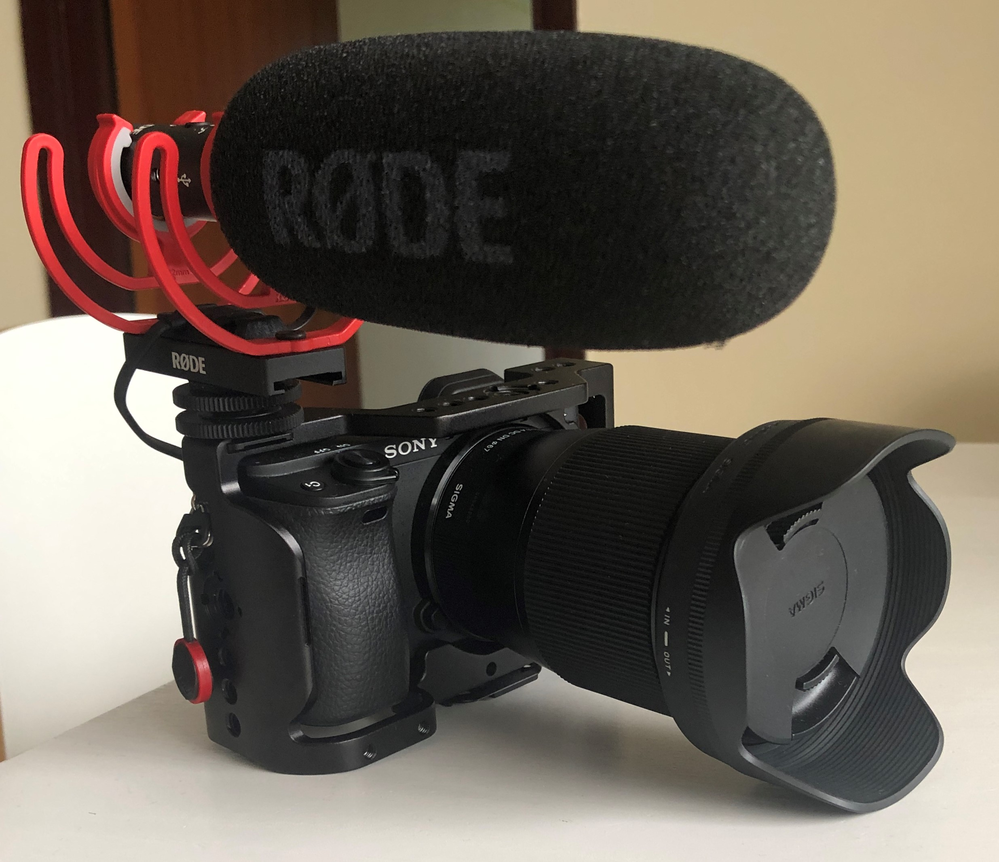
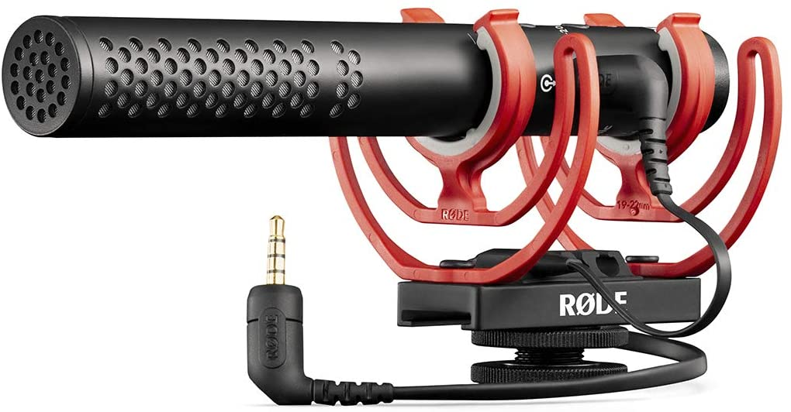
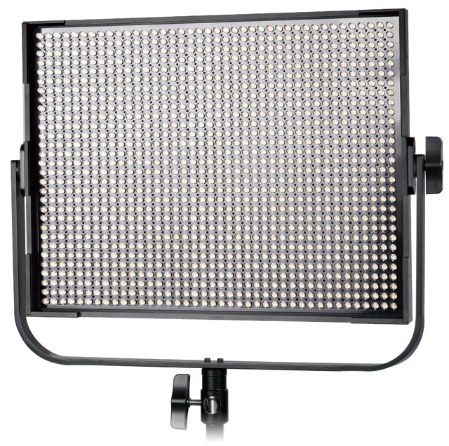
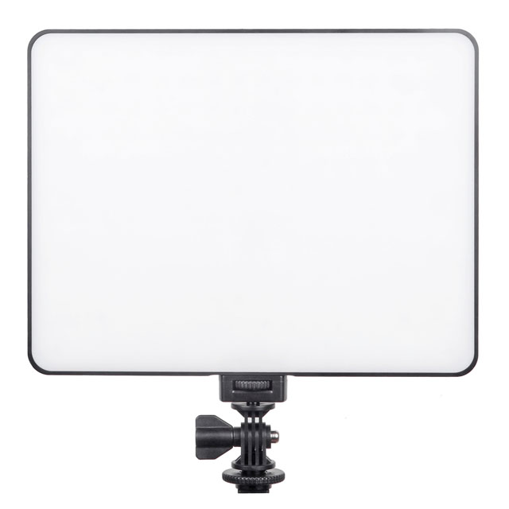

# CoderDave YouTube Setup and Gear

> UPDATED: 8 October 2020

Since I'm making a lot of YouTube videos (_check out my channel [CoderDave](https://www.youtube.com/CoderDave)_), I've invested in some __good gear__ that you can find down below.

This is currently my main  Rig:

## Camera

I wanted to have the clearest image possible, without the need of selling some organs to pay for the camera.

I also wanted the option of using an external mic with my camera (I use a Lav mic in some videos). In addition, I wanted a camera that doesn't have a time limit on video recording (most DSLR and Mirrorless have some limitation) and that of course could record in 4k.

I decided to get the __Sony A6400__ after watching hundreds of YouTube videos and reviews.I found a very good deal (Cameras and photo accessories are quite cheap here in Hong Kong), so I went with the body + kit lense option (with the 16mm-50mm lense).

I also got a __Sigma 16mm f/1.4__ since it's a highly recommended lens and it does incredible in low light. With the low aperture, I'm also able to get a pretty amazing depth of field, which also means my background is less distracting and viewers are more likely to focus on what I'm saying. This lense is just amazing, only downside is that it is fairly big and heavy (you can see it in the picture above).

You can find them here:

- Sony a6400 body + 16-35mm: https://amzn.to/3jG0BVh
- Sigma 16mm f1.4 lens: https://amzn.to/36GN2kC
- Sigma 24-70mm f2.8 lens: https://amzn.to/2SDvJsK

## Rig and Accessories

And of course I use a lot of accessories for my camera, I built a small rig.

- Camera Cage - UURig: https://amzn.to/2GPS83q
- Power Bank holder - SmallRig: https://amzn.to/3d5FXeM
- Arca Swiss mini clamps: https://amzn.to/33GLxks
- Variable ND Filter, 5 stops - K&F Concept : https://amzn.to/3nsPnWt
- Circular Polarizer Filter - K&FConcept: https://amzn.to/33GtNG5
- Camera holder for backpack straps - Peak Design: https://amzn.to/2F8YrOO 
- Elgato CamLink 4k (to connect the camera to the computer): https://amzn.to/3nuGYSg
- White balance and color tester - X-Rite ColorChecker Video: https://amzn.to/2GQMEFh

## Microphones

When I'm recording in studio, my main Mic is the same I use in the WFH setup, the __Maono AU-A04 Plus__. It is a decent Cardioid Condenser USB Microphone, with a good response to my voice tones.

As a secondary Mic, or primary if I'm recording outside of my studio, I have a __Rode VideoMic NTG__, which I think is the best on-camera shotgun Microphone money can buy (at least for now). It is simply amazing, imho way better than the VideoMic PRO+.

You can find them here:
- Rode VideoMic NTG: https://amzn.to/36MuxeH
- Maono AU-A04 Plus: https://amzn.to/33HrhQ1

## Lights

I use mainly 2 lights, both from _Viltrox_.

My ___key light__ is a __Viltrox VL-D85T__.

This light is fantastic! And best of all, it is pretty cheap.

It is a 1200 LEDs light that can be adjusted in both temperature (from 3300K to 5600K) and brightness (20-100%). It draws 85W at 100% 4500K, for a total of 9300LM.

Even tho it comes with a diffusion plate over the leds, I have a softbox for it, the __Viltrox VK-85__, to make it even softer.

[IMAGE HERE]

My secondary light is a __Viltrox VL-200T__, an ultrathin dimmable Bivolor LED light. Featuring 192 LEDs, it draws 30W at 100% 4400K. As its bigger sister, it is dimmable to 20% and the temperature is adjustable from 3300K to 5600K.

You can find this light here: https://amzn.to/3iDUEHa

And BOTH can be controlled by the same remote! Super handy.
